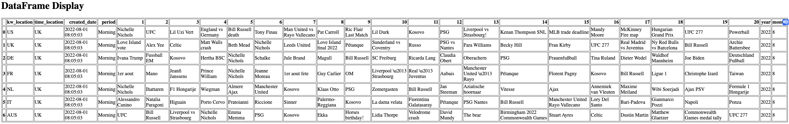
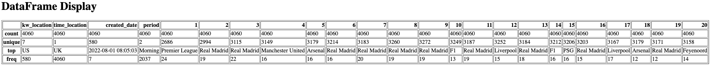
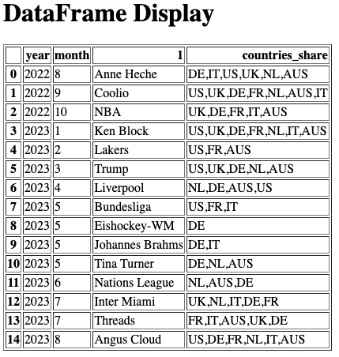
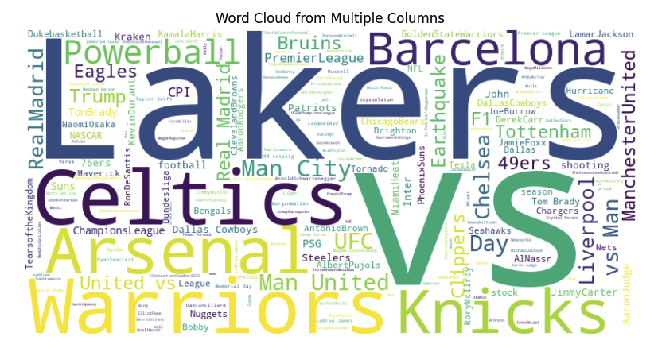
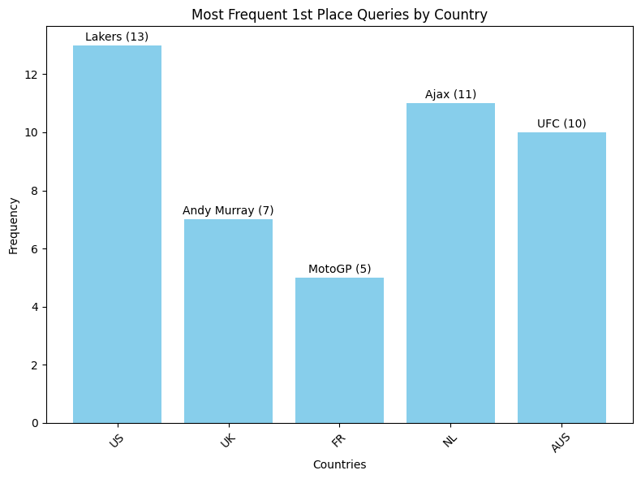
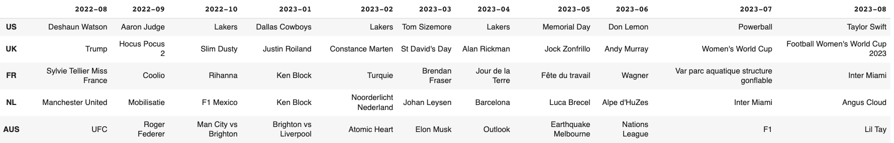
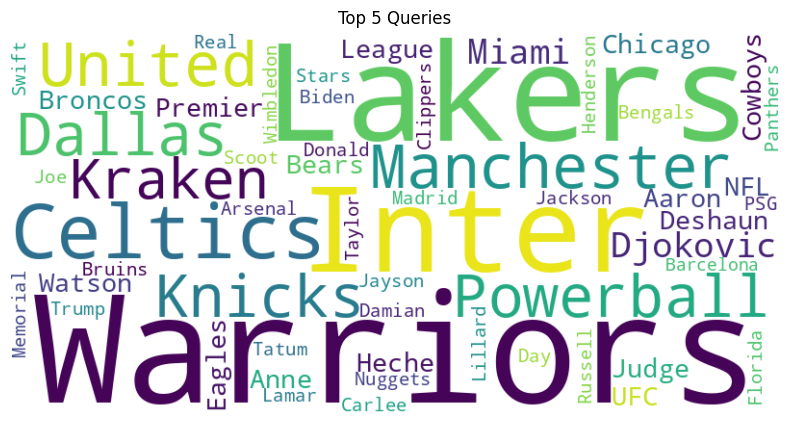

# [B반-b2조]데이터 시각화 웹 페이지 만들기
## 0. 프로젝트 소개

### FastAPI 기반 EDA 시각화 서버
  - FastAPI 기반 EDA 시각화 서버
  - 구동 방법
  ```bash
  git clone https://github.com/wschung1113/b2-webproject.git
  cd b2-webproject
  cd backend
  python -m venv .venv
  pip install -r requirements.txt
  uvicorn app:app --reload --port 8000
  ```

### Next.js 기반 EDA 시각화 프론트 엔드 
  - 백엔드  API 서버가 먼저 실행되어 있어야 합니다. 
  - 실행 방법
  ```bach
  git clone https://github.com/wschung1113/b2-webproject.git
  cd b2-webproject
  cd frontend
  npm install
  npm run dev
  ```

## 1. 데이터 소개
  - 출처: https://www.kaggle.com/datasets/lorentzyeung/top-20-most-searched-queries-in-google-search
  - 연/월별로 US, UK, Germany, France, Netherlands, Italy, Australia에서 가장 많이 검색된 Top 20 쿼리 데이터셋
  - 팀 내부적으로 22년 8월부터 23년 8월까지 총 1년간의 데이터를 사용하기로 결정


## 2. 데이터 취합
  - 각 .csv 파일을 순회하며 단일 DataFrame으로 취합
  ```python
    # Specify the directory containing CSV files
    directory_path = Path('data')

    # Initialize an empty list to store DataFrames
    dfs = []

    # Loop through CSV files in the directory
    for csv_file in directory_path.glob('*.csv'):
        df = pd.read_csv(csv_file, encoding='latin1')
        dfs.append(df)

    # Concatenate all DataFrames into one
    df = pd.concat(dfs, ignore_index=True)

    # take out first two meaningless columns
    df = df.iloc[:, 2:]
  ```
## 3. EDA
  - df.head()
    ```python
        @app.get("/head/", response_class=HTMLResponse)
        async def get_head(n_rows: int=None):
            if n_rows is None:
                n_rows = 5
            df_head = df.head(n_rows)

            # Convert the DataFrame to HTML
            df_html = df_head.to_html(classes='table table-striped table-hover')

            # Create an HTML template with the DataFrame embedded
            html_content = f"""
            <html>
            <head>
                <title>DataFrame Display</title>
            </head>
            <body>
                <h1>DataFrame Display</h1>
                {df_html}
            </body>
            </html>
            """

            return HTMLResponse(content=html_content)
    ```
    - query parameter로 head() 메소드가 보여줄 행의 수를 요청할 수 있음
    - localhost:8000/head?n_rows=7
    


  - df.describe()
    ```python
    @app.get("/describe")
    async def get_describe():
        df_desc = df.describe(include='object')

        # Convert the DataFrame to HTML
        df_html = df_desc.to_html(classes='table table-striped table-hover')

        # Create an HTML template with the DataFrame embedded
        html_content = f"""
        <html>
        <head>
            <title>DataFrame Display</title>
        </head>
        <body>
            <h1>DataFrame Display</h1>
            {df_html}
        </body>
        </html>
        """

        return HTMLResponse(content=html_content)
    ```
    - localhost:8000/describe
    
  

  - 각 연월별 가장 많이 검색된 쿼리와 해당 쿼리가 가장 많이 검색된 국가
    ```python
    @app.get("/mode/")
    async def get_mode():
        # most frequent query by year and month
        most_frequent = df.groupby(['year', 'month'])['1'].apply(lambda x: x.mode())

        # Create a new DataFrame to present the results
        result_df = most_frequent.reset_index()

        countries_share = []
        for i in range(len(result_df)):
            year = result_df.loc[i, 'year']
            month = result_df.loc[i,'month']
            top_query = result_df.loc[i, '1']
            countries_share.append(','.join(df[(df['year']==year) & (df['month']==month) & (df['1']==top_query)].kw_location.unique()))
        result_df.loc[:, 'countries_share'] = countries_share

        # Convert the DataFrame to HTML
        df_html = result_df.iloc[:, [0, 1, 3, 4]].to_html(classes='table table-striped table-hover')

        # Create an HTML template with the DataFrame embedded
        html_content = f"""
        <html>
        <head>
            <title>DataFrame Display</title>
        </head>
        <body>
            <h1>DataFrame Display</h1>
            {df_html}
        </body>
        </html>
        """

        return HTMLResponse(content=html_content)
    ```
    - localhost:8000/mode
    

  - Top N Word Cloud
    ```python
    @app.get("/word-cloud/", response_class=HTMLResponse)
    async def plot_wc(country: str=None, n_ranks: int=None):
        
        # word cloud
        if country is None:
            df_country = df.copy()
        else:
            df_country = df[df['kw_location'] == country]
        columns = df_country['1']
        for i in range(n_ranks):
            df_country.iloc[:, 6+i] = df_country.iloc[:, 6+i].apply(lambda x: x.replace(' ', ''))
            if i != 0:
                columns += ' ' + df_country.iloc[:, 6+i]
            
        # Concatenate text from multiple columns into a single string
        combined_text = ' '.join(columns)

        # Create a WordCloud object
        wordcloud = WordCloud(width=800, height=400, background_color='white').generate(combined_text)

        # Display the word cloud plot
        plt.figure(figsize=(10, 5))
        plt.imshow(wordcloud, interpolation='bilinear')
        plt.axis('off')
        plt.title('Word Cloud from Multiple Columns')
        # plt.show()

        # Save the plot as an image in memory
        buffer = BytesIO()
        plt.savefig(buffer, format="png")
        buffer.seek(0)
        
        # Encode the image data as base64
        image_base64 = base64.b64encode(buffer.read()).decode("utf-8")

        # Return an HTML page with the image
        html_content = f"""
        <html>
        <head>
            <title>Matplotlib Plot on Web Page</title>
        </head>
        <body>
            <h1>Matplotlib Plot</h1>
            
        </body>
        </html>
        """

        return HTMLResponse(content=html_content)
    ```
    - 국가 미지정 시 모든 국가 대상으로 word cloud 생성
    - 가능 입력 국가: US, UK, DE, FR, NL, AUS, IT
    - n_ranks의 경우 Top n_ranks 쿼리들로 이루어진 word cloud 생성 (1 이상 입력)
    - http://localhost:8080/word-cloud?country=US&n_ranks=5
    - localhost:8000/word-cloud?country=US&n_ranks=5
    


- 국가별 검색 순위 1위를 가장 많이 한 검색어

    ```python
    # Extract countries and queries
    countries = list(firsts.keys())
    queries = [entry[0] for entry in firsts.values()]
    counts = [entry[1] for entry in firsts.values()]

    # Create a bar plot
    plt.figure(figsize=(8, 6))
    plt.bar(countries, counts, color='skyblue')
    plt.xlabel('Countries')
    plt.ylabel('Frequency')
    plt.title('Most Frequent 1st Place Queries by Country')
    plt.xticks(rotation=45)

    # Annotate the queries on the plot
    for i, count in enumerate(counts):
        plt.text(countries[i], count + 0.1, f'{queries[i]} ({count})', ha='center', va='bottom')

    plt.tight_layout()
    plt.show()
    ```
    
    

    - 국가별 월별 일간 1등을 가장 많이 한 검색어

    ```python
    merged_df = pd.concat([us_top1, uk_top1, fr_top1, nl_top1, aus_top1], axis=1)
    merged_df.set_index('year_month', inplace=True)
    merged_df.index = ['2022-08','2022-09','2022-10','2023-01','2023-02','2023-03','2023-04','2023-05','2023-06','2023-07','2023-08']
    merged_df.columns = ['US', 'UK', 'FR', 'NL', 'AUS']
    merged_df.T
    ```
    

- 한 국가에서 월별 top 10에 가장 많이 올라온 검색어 5개 (미국)

    ```python
    from wordcloud import WordCloud

    top_keywords = [keyword for queries in top_5_queries.values() for keyword in queries]

    wordcloud = WordCloud(width=800, height=400, background_color='white').generate(' '.join(top_keywords))

    plt.figure(figsize=(10, 5))
    plt.imshow(wordcloud, interpolation='bilinear')
    plt.axis('off')
    plt.title('Top 5 Queries')
    plt.show()
    ```

    
